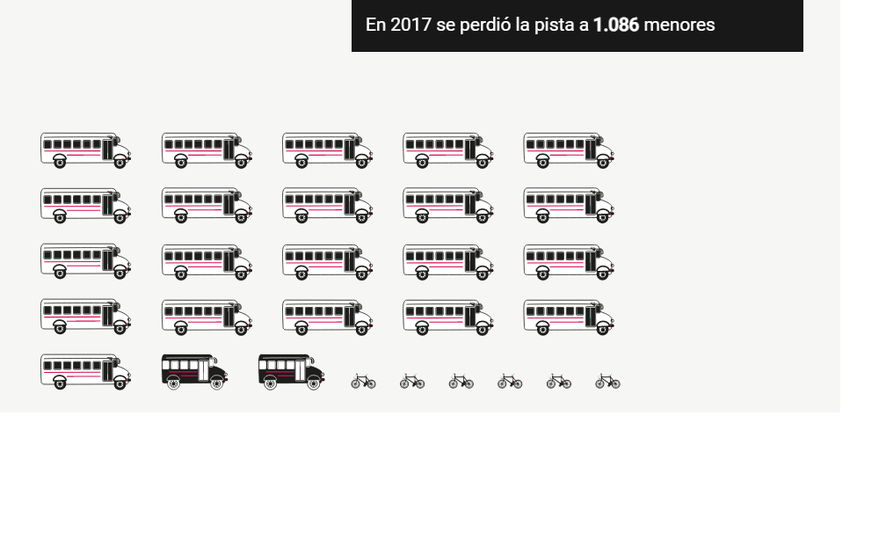
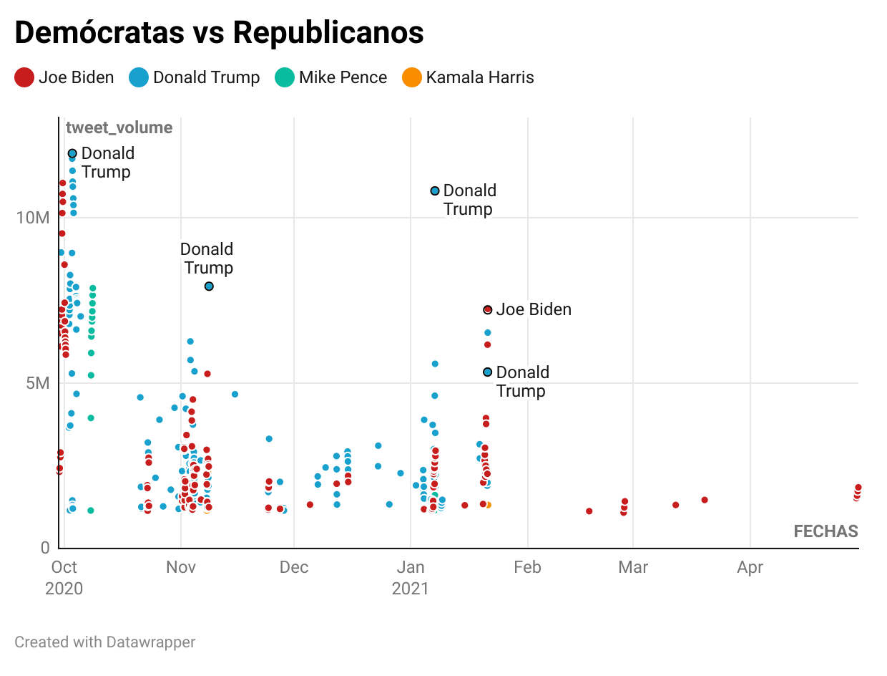
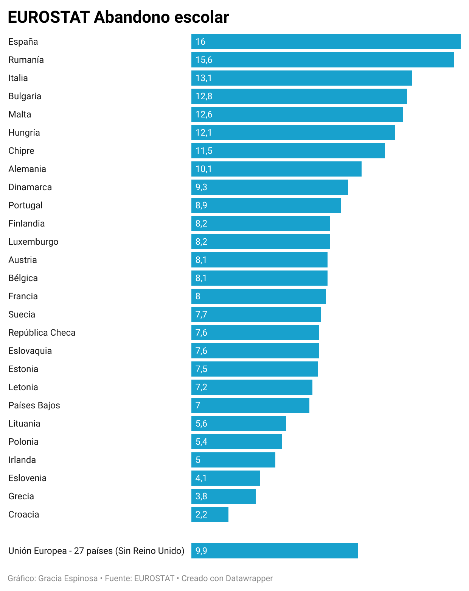
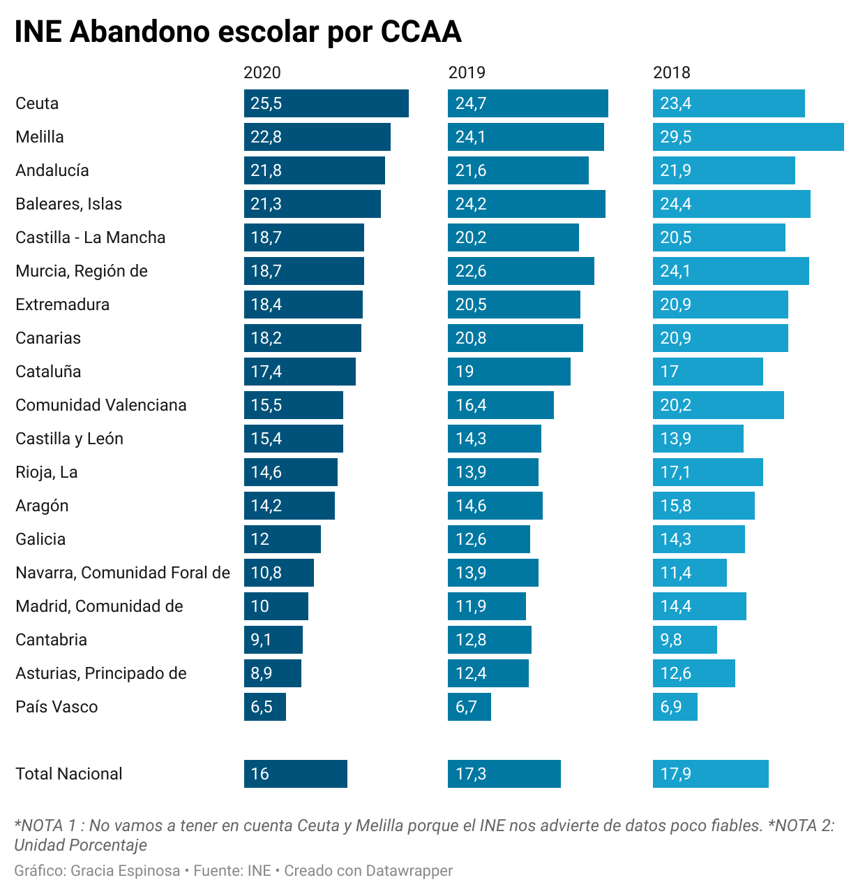
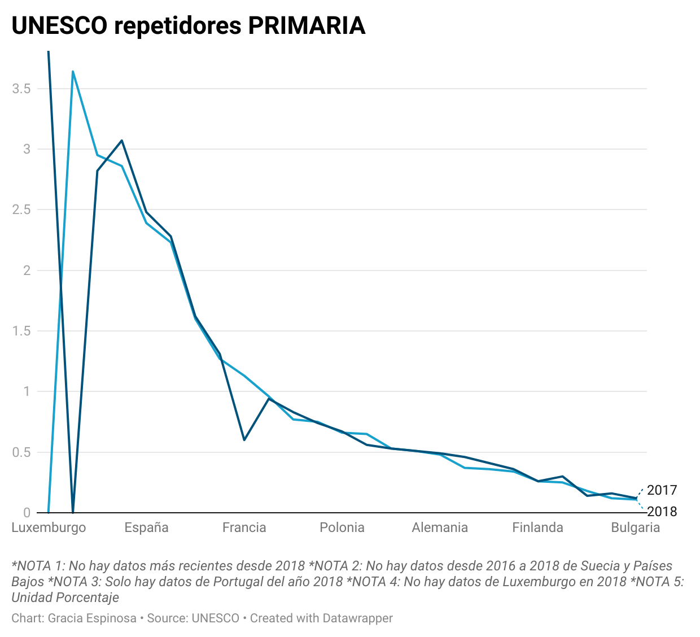

# Actividad 1: Comentario de visualización de datos

## Gracia Espinosa-Arroquia Marcos

Antes era inconcebible que los periodistas tuviéramos que aprender nociones de informática estadística o de diseño gráfico. Sin embargo, hoy en día se ha convertido en un requisito impensable para poder elaborar un buen reportaje de investigación. Es más, la demanda de profesionales con este tipo de conocimientos ha aumentado tanto que, en los últimos años, diarios como **El Mundo** o **eldiario.es** han creado su propia sección dedicada a esta disciplina periodística, conocida con el nombre de periodismo de datos.

Precisamente, de este último medio digital que acabo de mencionar analizaré una de sus publicaciones más interesantes del 2021. No solo por su contenido informativo, sino también por su gran atractivo visual para llamar la atención al lector. Me estoy refiriendo al [mapa interactivo sobre las últimas elecciones madrileñas](https://www.eldiario.es/datos/resultados-elecciones-madrid-calle-calle-consulta-gano-manzana_1_7900153.html). 

Un acierto porque refleja de forma clara qué partido político gano en cada calle de la capital. Así como datos de interés como el partido más votado hace dos años o la victoria del PP sobre VOX o Ciudadanos. Además, puedes tanto ampliar como alejar la vista del mapa de la comunidad sin que se pierda calidad en cuanto a imagen o información.

Otro artículo interesante es el que ha publicado **Newtral** el viernes 11 de noviembre, titulado «[Menores no acompañados en Europa](https://www.newtral.es/especiales/menores-extranjeros-no-acompanados-europa/)». Al igual que la publicación anterior, desde el punto de vista visual, es fascinante. Lo más llamativo del reportaje es la representación que hacen de los menores desparecidos en España, puesto que utilizan medios de transporte para contabilizar las desapariciones (un autobús equivale a 50 menores, un minibús a 15 y una bicicleta a un solo menor). Además, su diseño al estilo cómic encaja perfectamente con el tema que se trata. 

Continuando con los medios españoles no puedo obviar la labor que hacen desde **El Orden Mundial**. Los temas que escogen son variados y diferentes a los que se suelen ver en el periodismo de datos más formal. A pesar de que podría escoger prácticamente cualquier mapa/gráfico de este último año, me he decantado finalmente por el [mapa de los enchufes en el mundo](https://elordenmundial.com/mapas-y-graficos/el-mapa-de-los-enchufes-en-el-mundo/). 

Es curioso e incluso espectacular el diseño del mapa. Así como el que aparece en esta misma publicación sobre la [contaminación lumínica en el mundo](https://elordenmundial.com/mapas-y-graficos/mapa-contaminacion-luminica-mundo/). 

Por poner una pega, el texto es bastante escaso con respecto a los anteriores reportajes. No obstante, su brevedad y concisión es lo que le aporta frescura. 

Por último, quiero destacar la representación de datos que más me ha gustado en este año que está a punto de concluir. Se trata del [informe sobre liderazgo femenino en los medios de comunicación](https://reutersinstitute.politics.ox.ac.uk/mujeres-y-liderazgo-en-los-medios-informativos-en-2021-evidencias-de-12-mercados), que llevaron a cabo **Reuters** y la **Universidad de Oxford** con motivo del día de la mujer el pasado 8 de marzo. En él aparece una comparativa por países de las mujeres que desempeñan su cargo como periodista o como jefas de un medio de comunicación y, a pesar de ser un informe, considero que es un tema interesante, en el cual hay un buen análisis de la situación actual. 

Los gráficos utilizados no son las clásicas barras, sino puntos que van escalonando según el país del que se trate y el porcentaje de mujeres que lideran redacciones en cada país. En otro gráfico se puede ver la [Igualdad de género vs. % de mujeres que lideran redacciones](https://datawrapper.dwcdn.net/w5zHN/1/)

# Actividad 2: Comentario crítico de visualización

## Gracia Espinosa-Arroquia Marcos

El mejor periodismo de datos se reúne en torno a los premios Sigma, patrocinados por Google News Initiative, cuyo fin es premiar los mejores trabajos de esta disciplina periodística. En esta segunda edición se recibieron un total de 545 proyectos de 68 países, de los cuales se seleccionaron únicamente 140. Finalmente fueron galardonados 13, y otros 7 consiguieron una mención especial. Muchos de ellos han tenido como tema principal la pandemia.

Un buen ejemplo de ello es **[Anatomy of Singapore's outbreak](https://graphics.reuters.com/HEALTH-CORONAVIRUS/SINGAPORE-CLUSTERS/bdwpkdgngvm/)**, realizado por **Manas Sharma** y **Simon Scarr**. Se publicó en **Reuters**, concretamente en la sección de graphics, el 22 de mayo de 2020. Este reportaje interactivo nos cuenta cómo se propagó el virus en el país asiático a través los trabajadores extranjeros que compartían habitación, en su mayoría procedentes de Bangladesh, China e India. Para ello utilizaron como fuente el Ministerio de Trabajo de Singapur los datos que dio el Ministerio de Salud hasta el 20 de abril sobre los infectados por coronavirus.

El reportaje está dispuesto en la página web del medio inglés. Para poder leer el reportaje hay que ir desciendo con la rueda del ratón. El texto está en negro sobre un fondo blanco. Hay un total de seis visualizaciones, dos de ellas animadas. 

En la **primera** podemos ver cómo se expande de forma circular el virus desde enero hasta el 19 de abril de 2020, aquel mes se registraron un gran número de casos entre los empleados extranjeros que convivían juntos. Como consecuencia, el Ministerio de Sanidad dejo de contabilizar los casos. El color azul se corresponde con los casos importados, el gris se refiere a los contagios entre locales y el rojo al de estos trabajadores extranjeros. 

La **segunda animación** sigue la forma circular de la anterior y prosigue en su contabilización desde el 20 de abril hasta el 16 de mayo, pocos días antes de publicarse este reportaje de datos. En ella observamos de forma muy visual cómo los casos dormitorio (25.525) son superiores a los locales (1.979) y a los importados (571).

En la **tercera visualización**, que esta vez es estática, podemos ver en qué lugares de Singapur se concentraban los principales 
dormitorios con infectados. 

En la **cuarta** en qué sector trabajaban estos infectados. 

La **quinta** menciona que este tipo de dormitorios se concentran en áreas grandes y que estén más industrializadas. Por último, los autores plasman en un mapa los grupos dormitorios que había el 17 de mayo del pasado año. 

# Actividad 3: Creación de una visualización 

Los pasos que voy a describir son los mismos que hice en la clase del jueves 18 de noviembre, a la cual solo estuvimos haciendo la actividad en directo otra compañera (Beatriz) y yo.

Lo primero que tenemos que hacer es conseguir el archivo TRESCA en el Github de nebrija-2021 (en la carpeta de data).

Le damos a RAW y nos sale el archivo en cuestión. Si estamos en Google Chrome selecionamos control + s y lo guardamos donde queramos. En mi caso, yo lo he guardado en la carpeta de descargas.

A continuación abrimos el Openrefine, crear nuevo proyecto, y examinar el archivo que hemos obtenido en formato csv. 

Le damos a que las columnas las separe en comas (CSV) y que este codificado en UTF-8
Después, le damos de nuevo a crear proyecto con el nombre nebroja-republicanos-vs-democratas. 

Una vez hecho esto vamos a la columna de las fechas (que antes se llama as-of) y seleccionamos editar celdas-Common Transforms-Date. Haremos lo mismo en la columna del volumen de tweets (editar celda-Common transforms-to number). 

A continuación, exporto estos datos y los subo al Datawrapper. Entre las opciones que nos facilita es importante que en el eje horizontal estén las fechas y en el vertical el número de tuits.Finalmente la visualización que obtengo es esta: (https://www.datawrapper.de/_/mi4Lz/)

Como podrá ver no es idéntica a la gráfica que mostró al final de la clase del día 23 de noviembre, pero se parece en el formato puesto que he seleccionado el tipo de gráfico que comentó que le gustaba más.

Sin embargo no he conseguido hacer la distribución de datos que hizo en el Openrefine (dividir los tuits entre los cuatro políticos estadounidenses) para obtener una mejor visualización.

# ESPAÑA ENCABEZA LA LISTA DE ABANDONO ESCOLAR EN EUROPA
## Gracia Espinosa-Arroquia Marcos
### • Con una tasa del 16%, seis puntos por encima de la media europea, jóvenes de entre 18 y 24 años deciden no continuar con sus estudios

### • El Real Decreto del 16 de noviembre de 2021 eliminará los exámenes de recuperación en la ESO con el fin de reducir esta cifra

Quién no ha escuchado alguna vez la siguiente frase: «Has sacado un 4’8 pero te pongo un 4 porque sé que en la recuperación vas a sacar mejor nota». Estas palabras que a priori tienen la finalidad motivar al estudiante se ha visto que tiene el efecto contrario, y lo que es peor, puede desembocar en abandono escolar.

De hecho, el último informe de Eurostat (gráfico 1) mostraba que el 16% de los jóvenes españoles de 18 y 24 años no ha completado la etapa secundaria, superando a Rumanía (15’6%) e Italia (13’1%). Un varapalo para la Unión Europea, que se había marcado el pasado año un umbral máximo del 10%.

 
La elevada tasa de abandono escolar prematuro es un problema que se prolonga desde hace muchos años, es más, España lleva desde 2011 sin bajarse de los primeros puestos de países con peores tasas en relación con este asunto, aunque en los últimos tiempos ha ido descendiendo considerablemente la proporción de abandonos prematuros, sobre todo con la crisis de 2008.

Siguiendo los datos del INE del 2020 (gráfico 2 ), las cuatro de las comunidades autónomas con mayor tasa de abandono de la población de 18 a 24 años son Andalucía (con casi un 22%), Islas Baleares (21%) Castilla La Mancha y Murcia (19%). Paralelamente, según las Estadísticas e indicadores del Ministerio de Educación y Formación Profesional, Murcia es la que concentra mayor número de repetidores en la ESO (11%). Pero muy de cerca le sigue Andalucía y Castilla La Mancha. Todos estos datos vienen a mostrar que puede haber una relación entre repetir curso en la ESO y dejar los estudios prematuramente. 

Ahora bien, ¿en qué curso se repite más durante esta etapa escolar? En primero de secundaria, precisamente, cuando Murcia (con casi un 12’5%), Andalucía (12’3%) y Castilla La Mancha (12%) vuelven a coincidir como tres de las comunidades con los porcentajes más altos de la península. ¿Casualidad? 

En 2018 el Instituto de Estadística de la UNESCO advertía que España era el país que tenía más alumnos repitiendo el primer ciclo de secundaria (gráfico 3), y en menor medida en educación primaria (gráfico 4). Aunque, nuestro país tampoco estaba para tirar cohetes. Solo había tres países de la UE por encima de nosotros: Portugal, Austria y Eslovaquia. 

*Gráfico 3*

*Gráfico 4*

El abandono prematuro del centro escolar provoca que el futuro de estos chicos y chicas esté ligado de por vida a la precariedad laboral. El 27,6% de los españoles de entre 25 y 34 años que no tiene el título de Educación Secundaria está desempleada, tal como se pueden ver en los datos actualizados de la OCDE. 

Por ese motivo, tal como afirmaba la ministra de Educación y Formación Profesional, Pilar Alegría, el Gobierno aprobaba el 16 de noviembre de este año el real decreto 984/2021 para regular la evaluación, promoción y titulación en la Educación Secundaria Obligatoria, por lo cual se permitirá que los alumnos pasen de curso con asignaturas suspensas; es decir que a partir de ahora se suprimen los exámenes de recuperación en la ESO. Como consecuencia, la última palabra la tendrán los propios profesores de forma colegiada. 

Es cierto que harían faltas más medidas para evitar el abandono escolar, como aumentar el número de profesores que atiendan a los alumnos, invertir dinero en recursos electrónicos… pero por algo hay que empezar. 

# Actividad 4: Crear una visualización de datos desde 0

## Gracia Espinosa-Arroquia Marcos 
### ¿POR QUÉ HAS HECHO ESTE REPORTAJE DE DATOS?

El tema del reportaje surgió cuando el Gobierno anunció a principios de esta semana el [fin de las recuperaciones en la ESO](https://www.antena3.com/noticias/sociedad/asi-nueva-reforma-educativa-que-suprime-recuperaciones-escolares-eso-este-mismo-curso_20211115619349ce77bc800001a7004d.html). Aunque, es un asunto que ya sobrevolaba desde este verano como se puede comprobar en esta noticia de [El País](https://elpais.com/educacion/2021-06-16/los-centros-educativos-no-podran-hacer-repetir-a-un-alumno-basandose-solo-en-el-numero-de-suspensos.html). Es más, ese mismo mes Eurostat publicaba un informe en el que España aparecía como el [segundo país de la UE con mayor abandono escolar prematuro](https://www.20minutos.es/noticia/4743827/0/espana-es-el-segundo-pais-con-mayor-abandono-escolar-de-la-union-europea-y-supera-en-un-60-el-objetivo-de-2020/#:~:text=Uno%20de%20cada%20cinco%20j%C3%B3venes,%25%2C%20la%20quinta%20m%C3%A1s%20elevada.). Al mismo tiempo la OCDE afirmaba que [España es el país con más repetidores](https://www.20minutos.es/noticia/4822964/0/espana-es-el-pais-con-mas-tasa-de-repetidores-en-secundaria-obligatoria-de-la-ocde-y-cuadriplica-la-media-de-la-ue/). En este punto la pregunta era inevitable: «¿La tasa de abandono escolar estará relacionado con el número de repetidores?».

### ¿CUÁL ES EL FORMATO QUE HAS DECIDIDO PARA EL REPORTAJE Y SUS GRÁFICOS?

Lo he concebido desde un principio como un reportaje para un medio digital porque, personalmente, se me hace raro hablar de datos en televisión o radio, quizás porque no estoy acostumbrada. De todas formas, siempre he pensado que este tipo de reportajes se entiende mejor leyéndolos y mostrando los datos en barras/gráficas. 

Por ese motivo, una vez que descargué los datos, y los limpié con excel, se quedaron únicamente los datos correspondientes a los países de la Unión Europea (en el caso de Eurostat, Unceso y OCDE). 

Sin embargo, para las visualizaciones que he realizado en este reportaje, he tratado previamente los datos del libro de excel que elaboré en Periodismo de Datos I utilizando Openrefine. Concretamente los que se corresponde a la tasa de abandono escolar temprano en la UE y en nuestro país por comunidades autónomas. 

Estas visualizaciones han sido posible con el Datawrapper, donde lo único que tuve que hacer fue exportar el documento que obtuve de OpenRefine y subir los datos. A continuación escogí que los datos se visualizaran como un gráfico de barras.

